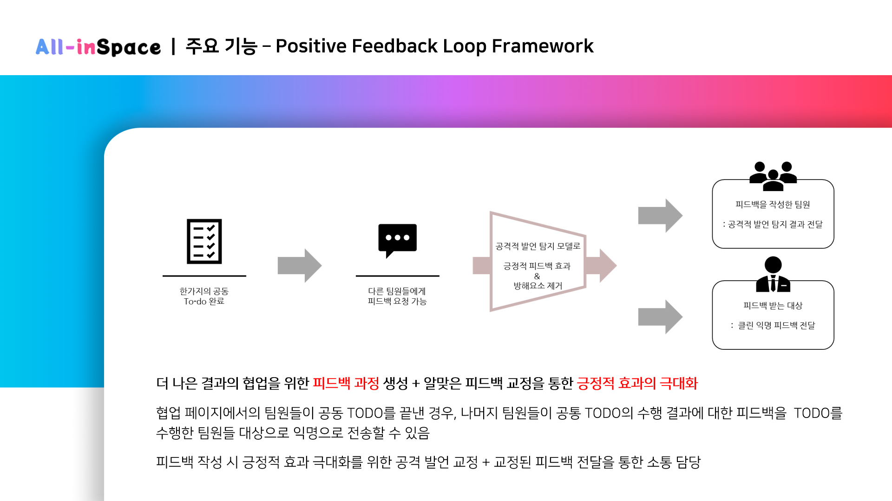
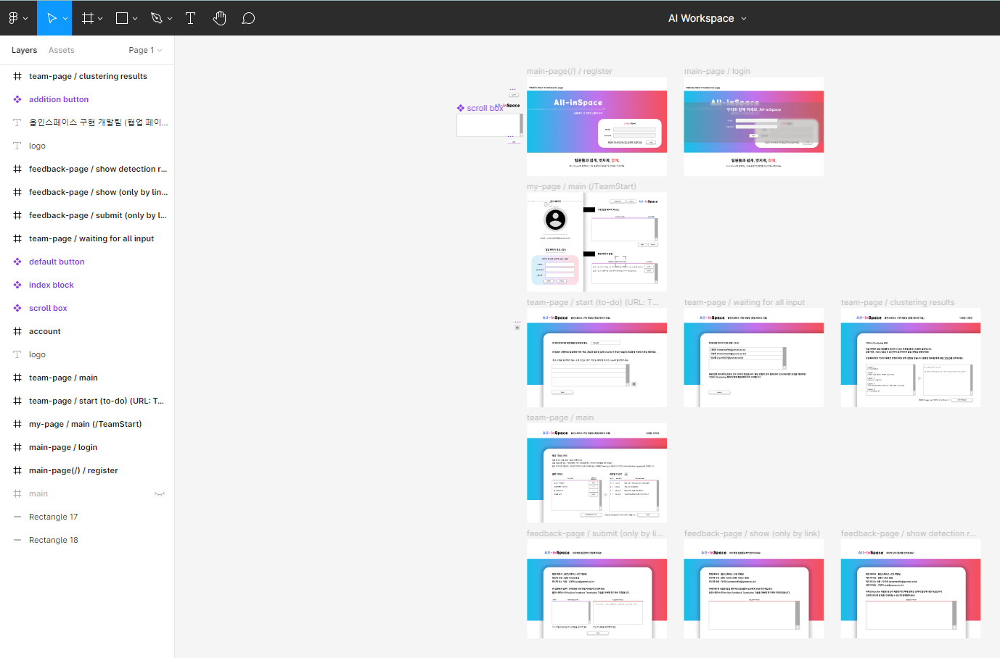
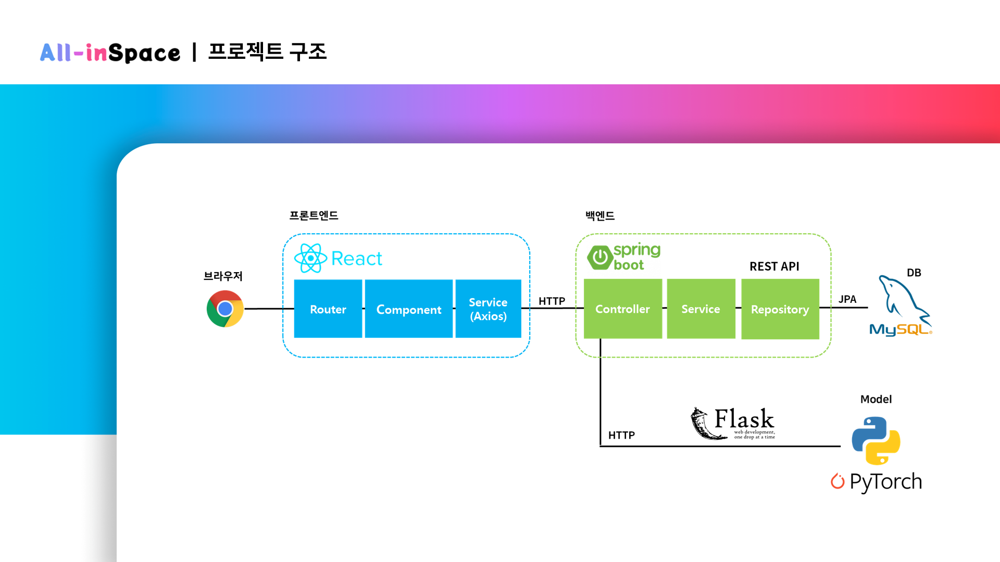
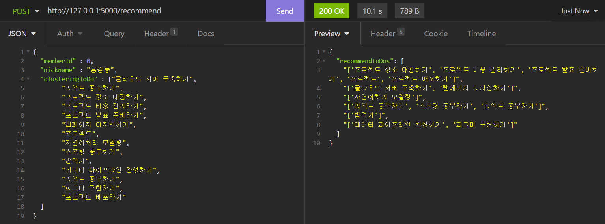
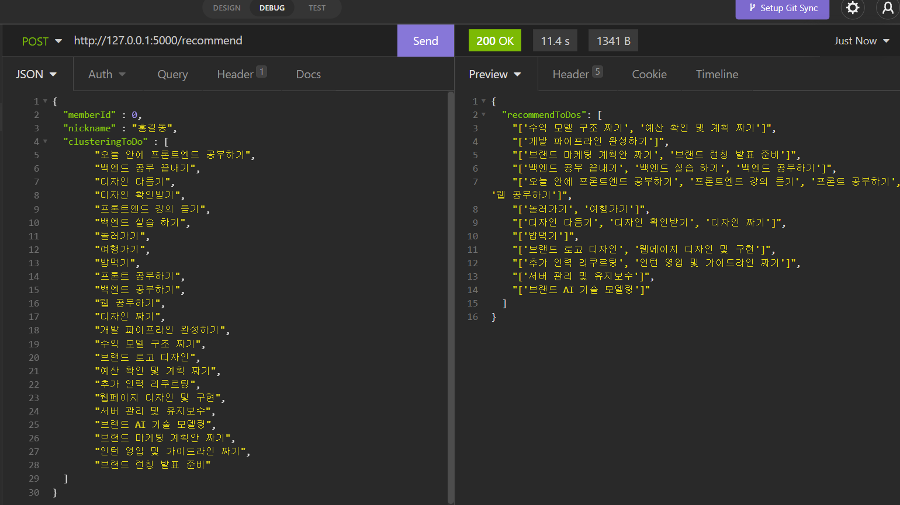
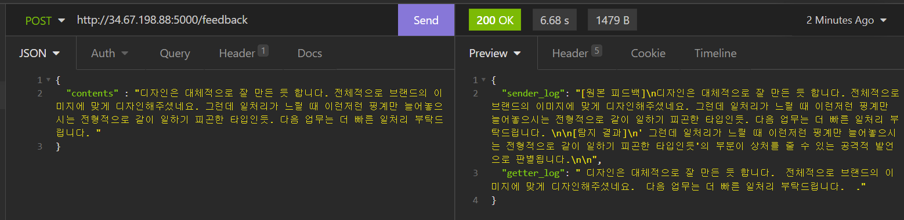
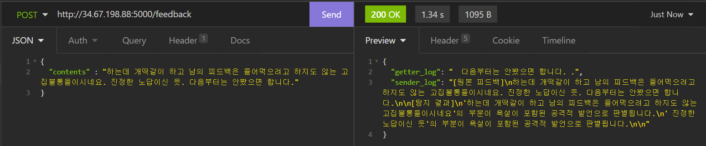
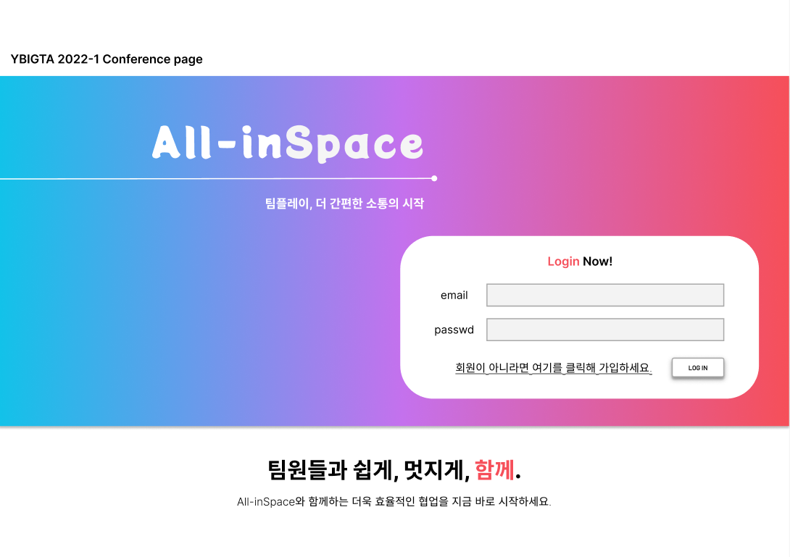
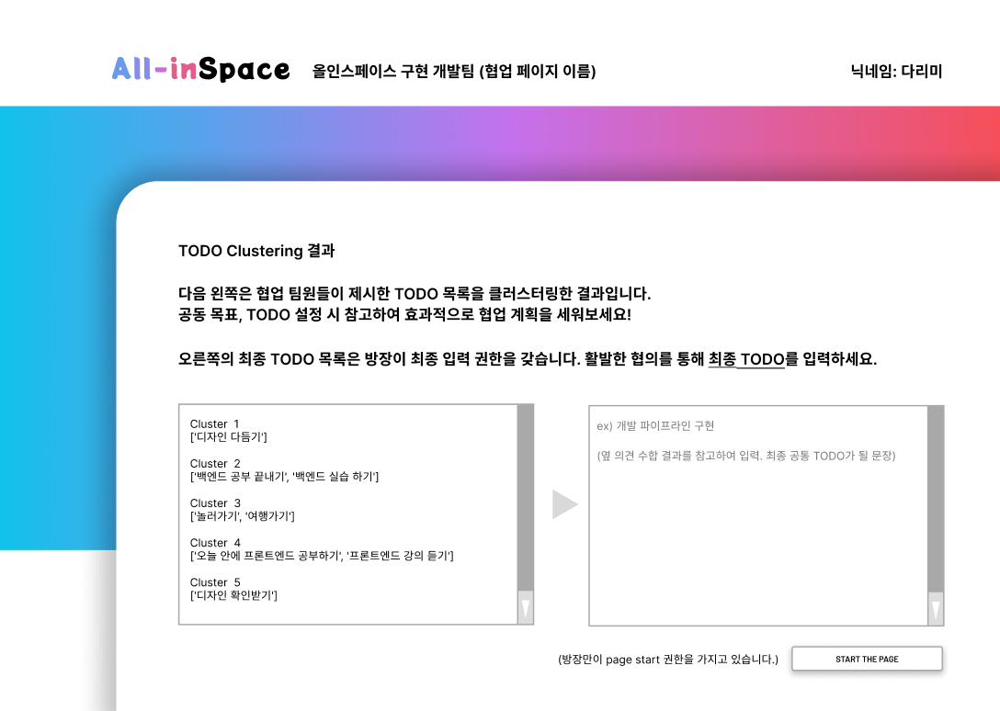
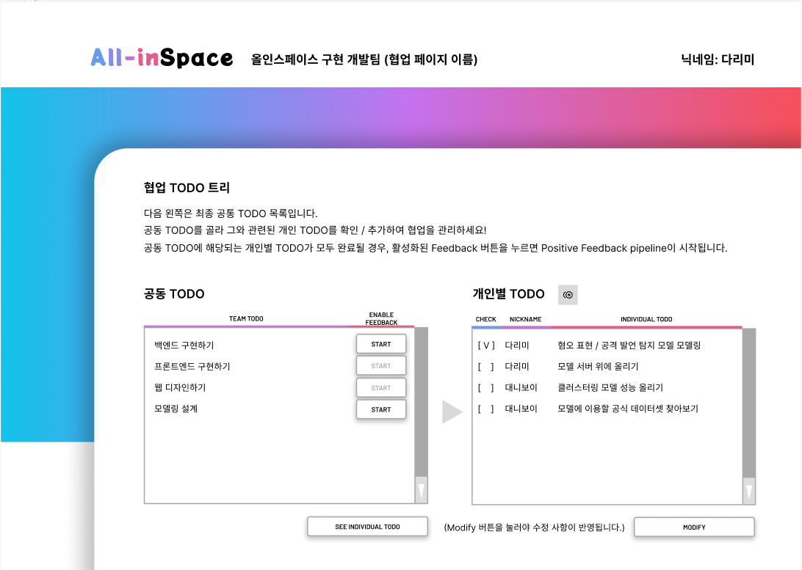

# 🗣 소통 활성화 협업툴, All-in-Space


            ```mdx-code-block
              import ReactPlayer from 'react-player';
            
              <ReactPlayer url="https://youtu.be/j0wQGtmTV7o" />
            ```
          

## 🗣️ 프로젝트 파이프라인 및 진행 과정

### 초기 브레인스토밍

* 초기 목표 : AI 를 결합한 기술로 (조별과제와 같은) 협업 시 분노와 절망을 줄일 수 있는 해결책을 하나의 프레임워크로 제시하자!
* 아이디어 구체화의 필요성 : 회의 시 “소통”이라는 가치를 키워드로 잡아 협업을 도울 수 있는 시스템에 대해 브레인스토밍
* All-in: 협업에 참여하는 모든 구성원이 효율적으로 협업을 계획할 수 있는 기술을 제공하자!

### 서비스에 담을 핵심 기술 확립 + Figma Design

* 서비스에 담을 핵심 기술 2개 확정: **To-Do Clustering + Positive Feedback Loop Framework**
* **To-Do Clustering**

  * 협업 팀에 속한 개인들이 각자 생각하는 이 팀에서 공동으로 달성해야 하는 목표, 분업이 필요한 업무(TODO)를 입력하도록 한다
  * 입력을 하나의 거대한 리스트로 모아 Textual Clustering 진행
  * Cluster 결과를 팀원들에게 공유해 팀에서 달성해야 한다고 생각하는 목표에 대한 Insight, 팀원들이 무엇을 공통으로 추구하고자 하는지에 대한 요약 정보를 제공 → **소통의 시작을 활성화할 수 있는 정보 제공**


    
* **Positive Feedback Loop Framework**

  * 한가지의 공동 to-do task가 완료되면, 그 task에 대해 피드백 요청이 가능
  * 팀의 나머지 팀원들이 task를 수행한 팀원에 대한 피드백을 기입 - 전달
  * 전달 과정 사이에서 공격적인 발언을 탐지하는 모델 사용
  * 공격적 발언 탐지 → 긍정적 피드백 효과를 방해하는 요소를 필터링하여 피드백 대상에게 전달 / 공격적 발언을 기입한 팀원에게 탐지 결과 전달 및 표현 지양 요청
  * → 공격적 발언이 최소화되는 피드백을 주고받을 수 있도록 협업 과정에서 바람직한 방향의 소통 독려

    
* 기술 확립 이후, 기술의 결과물을 담아 협업에 도움이 되는 방향으로 제공할 수 있도록 figma 디자인 툴을 이용해 페이지 디자인 제작

  

### Modeling + 각 Backend, Frontend, Model 연결 (파이프라인 설명 포함)

* Modeling 세부사항

  * **Clustering**
  * embedding : KoSBERT-KLUE-BERT-base 모델 사용
  * Kmeans + K 설정하기 위해 Silhouette Score, early stopping 개념 응용
  * **Feedback Framework**
  * KcElectra 모델을 이용: 익명 피드백을 이루는 문장 당 공격적 발언인지에 대한 Binary Text Classification 수행
  * KcBert 모델을 이용: 위에서 공격적 발언으로 탐지된 문장에 대하여 어떠한 유형의 공격적 발언인지 Multi-Label Classification 수행
  * 피드백 작성한 팀원에게 긍정적 피드백 전달을 위한 교정 사항 전달 + 피드백 대상인 팀원에게 공격 발언을 제외한 피드백 모음 전달
  * BEEP!, Apeach, Unsmile Dataset 등 여러 인터넷 상 혐오 발언, Hate-Speech에 대한 라벨링을 진행한 한국어 데이터셋을 이용하여 위 두 모델의 Fine-Tuning 진행
* 전체적 아키텍쳐

  * 워크스페이스가 보여지는 모든 부분들은 React를 통해 구성
  * 서버에서 정보를 저장 및 처리해주는 부분들은 모두 Spring으로 구현
  * axios를 활용하여 http 통신을 진행, DB: MySQL 활용
  * Pytorch를 활용한 NLP model: 별도의 flask 서버에 올려 함께 inference 된 결과값을 백엔드와의 통신을 통해 가져올 수 있도록 설계

  
* React 프레임워크를 이용해 구축된 웹사이트를 이용하여 **클러스터링 할 Todo,** 작성한 **피드백 내용 등의 input**을 전송
* Spring 기반의 백엔드 서버가 DB에 따로 저장을 한 후, 모델 서버(Flask)로 데이터를 전송
* 학습된 모델 서버에서의 inference를 통해 **클러스터링 된 todo목록, 또는** **필터링/탐지된 피드백 결과**를 다시 벡엔드 서버에 전송 : 페이지를 통해 user에게 전달

## 🗣️ 프로젝트 결과

* **To-Do Clustering**
  
  
* **Positive Feedback Loop Framework**

  * 성차별, 욕설, 지역적 발언 등의 다양한 유형의 공격적 발언 탐지 가능

  
  
* 페이지 구현 및 모델 얹기

  * Login
    
  * Clustering
    
  * To-Do Tree
    