# 📚 북실북실 - 아동도서관리 어플리케이션

```
import ReactPlayer from "react-player";

<ReactPlayer
  url="https://www.youtube.com/watch?v=qekmi_4Milw"
/>
```

## Project

### Pipeline

Phone Resource (Camera) 사용이 필수적인 만큼, React Native 기반 **어플리케이션 형태**로 제작

client side에서 사진을 찍으면 server가 **Book Detection 모델**에 전달 후 결과를 반환

DB에 저장된 user별 bookshelf 내의 books 목록 기반 **추천 모델 결과** 반환

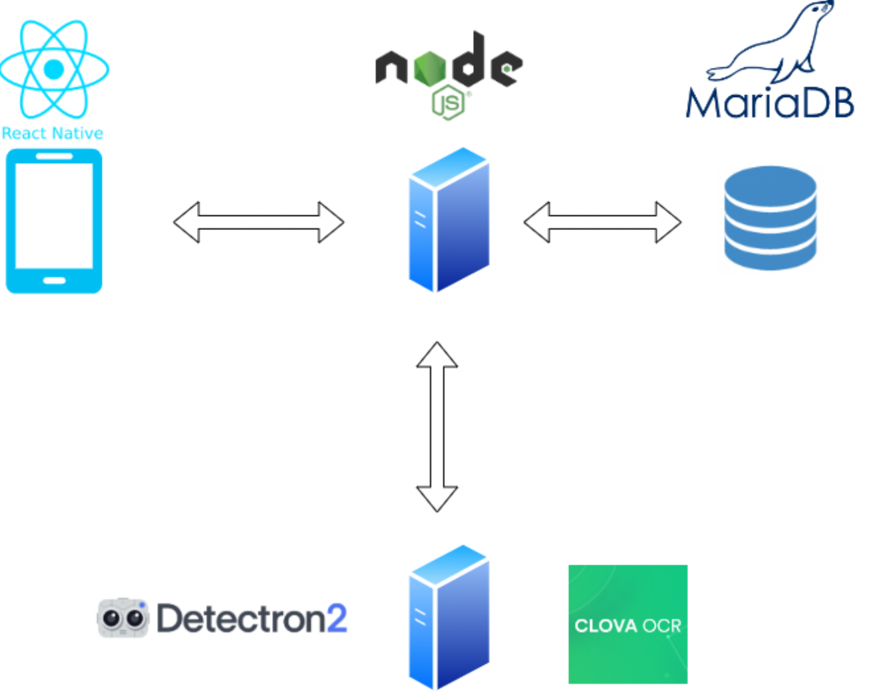

### Book Detection

**COCO dataset과 추가적인 책장 데이터셋 수집 및 라벨링**을 통해 685개의 image Dataset 구성

Segmentation 라이브러리인 **Detectron2**로 **Mask R-CNN** 학습

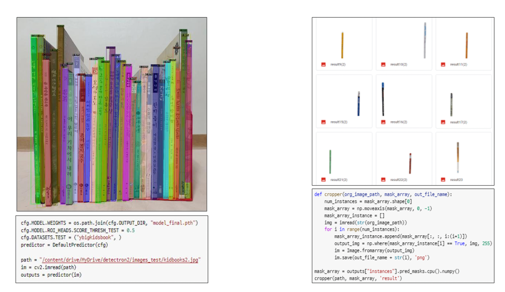
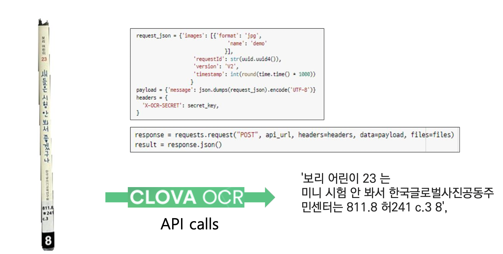

segmentation된 책등 이미지로부터 **CLOVA OCR**을 이용해 책 제목 텍스트 추출

출판사, 도서관 청구기호 등 불필요한 정보를 제거하고 정확한 책 제목을 추출하기 위해 데이터베이스의 책과 비교하여 **교정**

### Book Recommendation & Bookshelf Analysis

#### 도서 분석

- 특수문자 제거, 토큰화, 불용어 제거하여 전처리 → TF-IDF 임베딩 → K-means clustering으로 도서 군집화 → 각 cluster에 대한 LDA 토픽모델링
- 소장 도서 리스트 입력 시 네 가지 카테고리에 맞게 분석해주는 함수 정의
  - 책의 장르(놀이책/그림책/학습책) 분류 : TF-IDF 임베딩 → 각 도서과 코사인 유사도 계산 → 기준에 맞게 분류
  - 출판 연도 : 신간도서(2017~2022), 그 외(2005 ~ 2016), 스테디셀러 (1989 ~ 2004)
  - 대상 연령 (0~3세, 4~7세, 유아) : 크롤링한 데이터 기반 분류
  - 국가(한국도서,외국도서) : 글쓴이 이름이 세 글자면 한국도서로 분류
- 소장 도서를 키워드로 요약해주는 함수 정의
  - 제목 + 줄거리(1-gram, 2-gram) → SBERT 임베딩 → 유사도 계산 → 키워드 도출

#### 도서 추천

- 네이버 도서 크롤링한 데이터 이용
- 줄거리 데이터 Word Embedding (SBERT, FastText, GloVe, TF-IDF 시도 → 이중 SBERT와 TF-IDF 채택) → 코사인 유사도 계산
- 책장 사진에서 인식된 각 책들의 ISBN 리스트를 input으로 입력 시 각 도서와 데이터베이스의 책들의 코사인 유사도 계산 → 가장 높은/낮은 코사인 유사도를 가지면서 ISBN 리스트에 존재하지 않는 책 리스트를 output으로 주는 함수 정의
- 책장의 책과 유사하여 사용자가 관심을 가질만한 도서 & 책장에 없는 새로운 내용의 책 추천

### Frontend & Backend

- Frontend : React Native
- Backend : Node.js
- DB : mariaDB

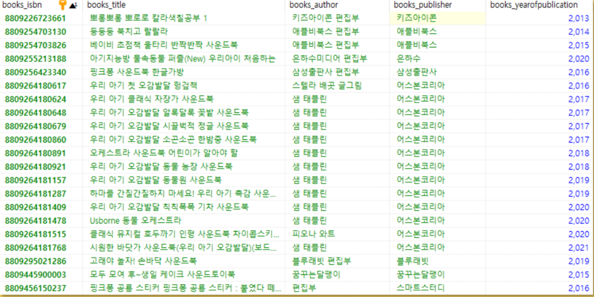
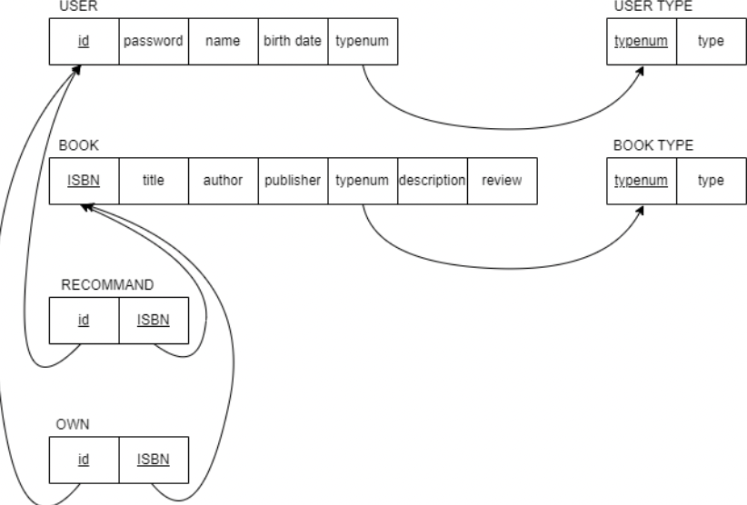
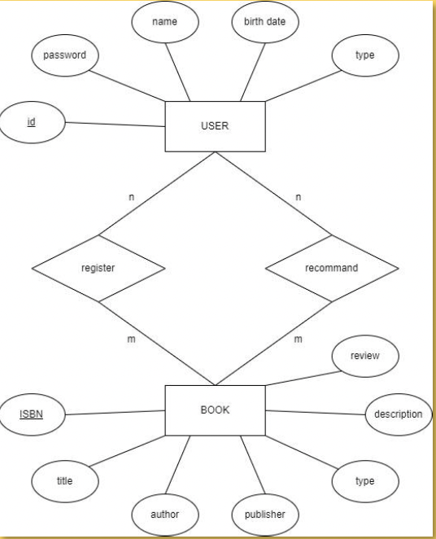

---

## 최종 결과물

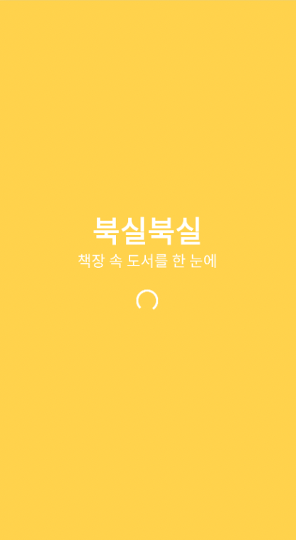
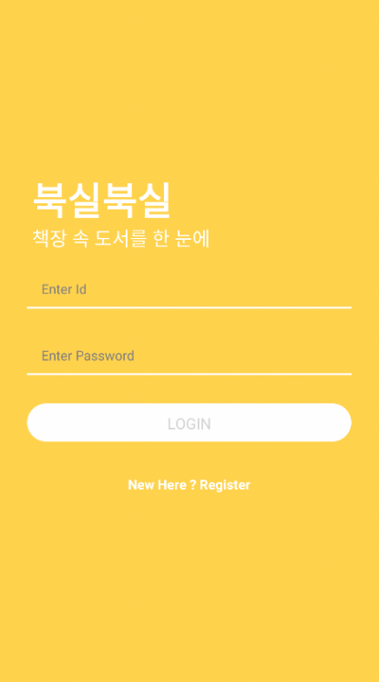
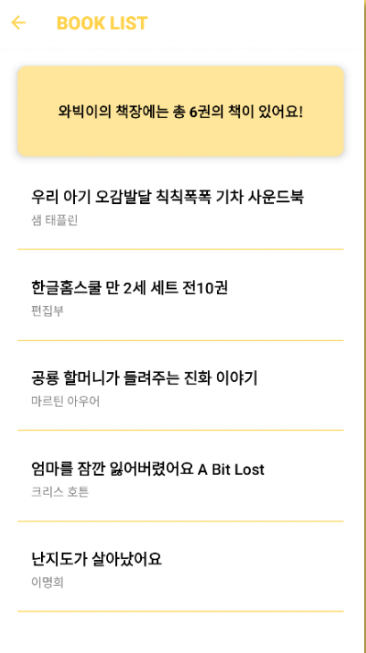
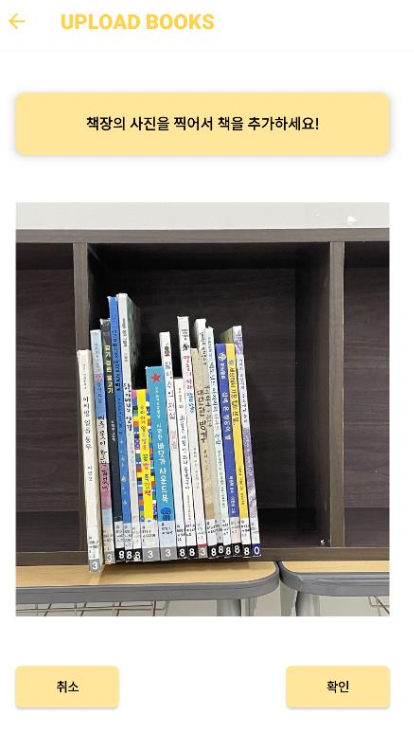
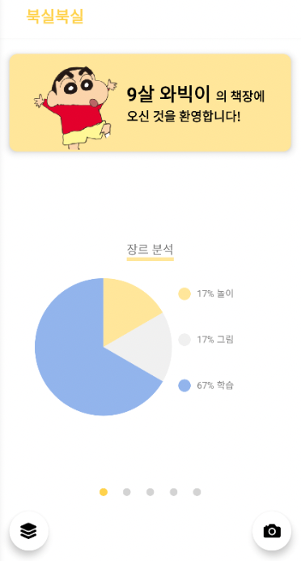
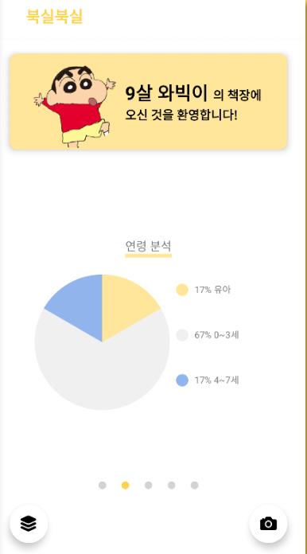
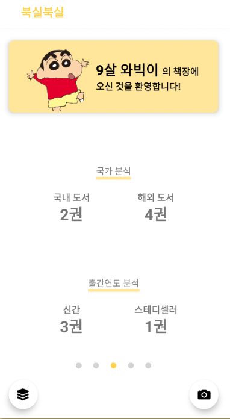
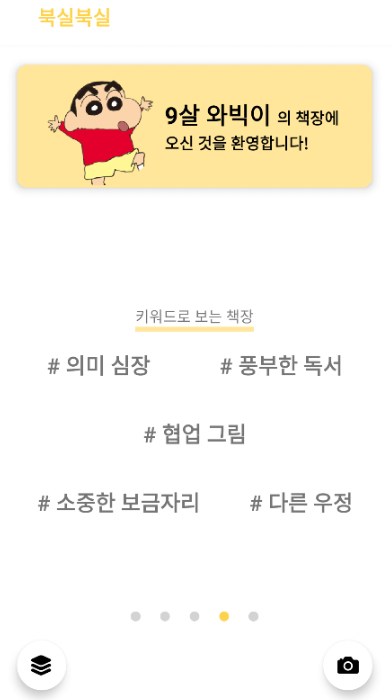
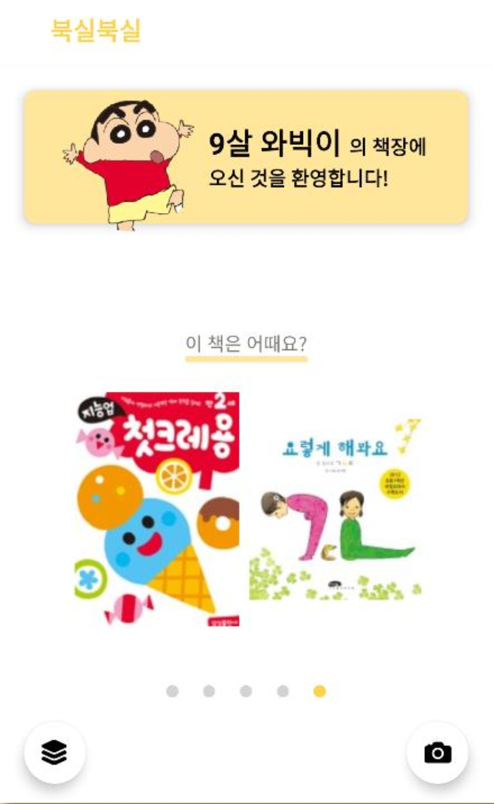
