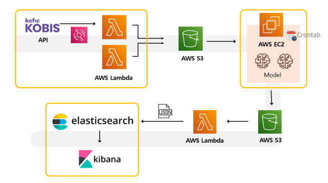
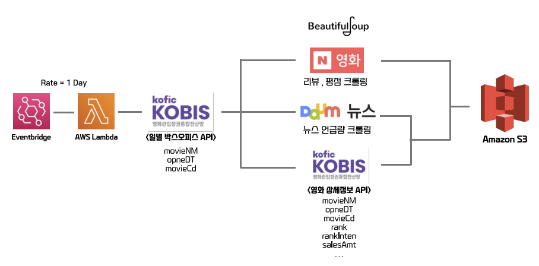
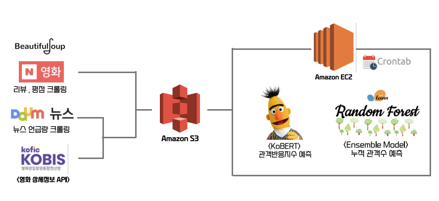
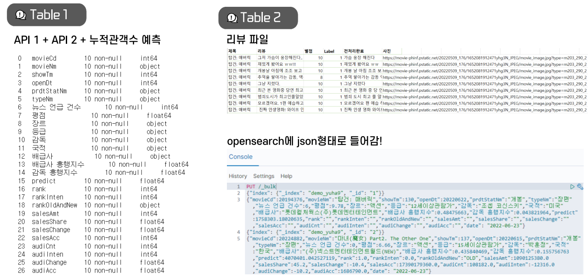
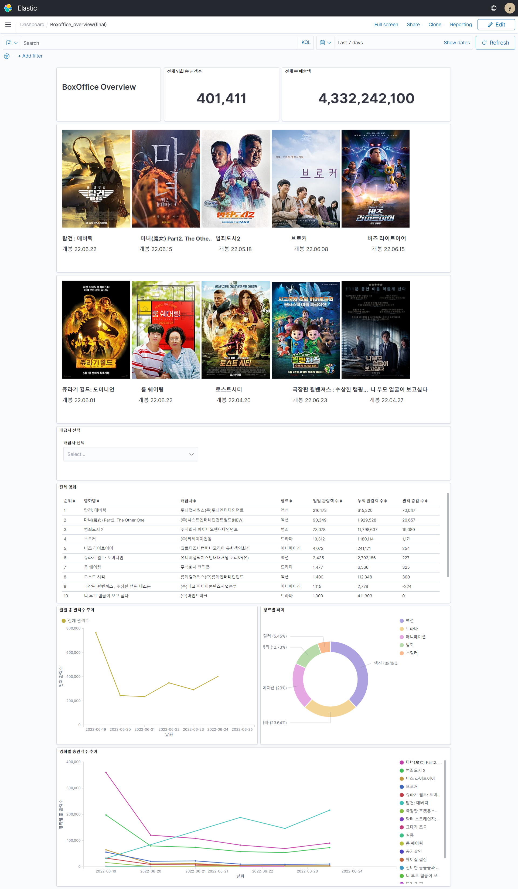
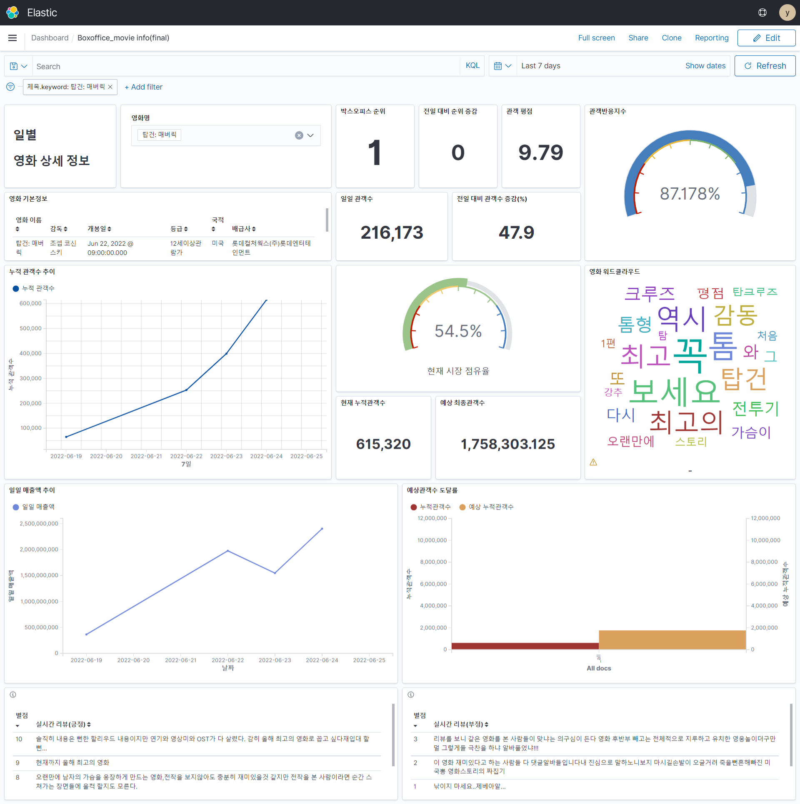

# 📽️ Boxoffice DashBoard

```mdx-code-block
import ReactPlayer from "react-player";

<ReactPlayer
url="https://www.youtube.com/watch?v=6J_9PxRvozk"
/>
```

## 📽️ 프로젝트 진행 과정

### 1. 아키텍쳐

- AWS lambda에 event bridge를 연결하여 하루에 한번 필요한 데이터를 API와 크롤링을 통해 받아옴
- 해당 데이터는 S3에 저장하며, 이 데이터를 EC2에서 crontab으로 특정 시간에 작동하게 되어 있는 모델에서 사용함
- csv파일로 흘러가는 데이터를 elasticsearch에 넣어주기 위해, 모델에서 나온 데이터가 S3에 저장되는 순간 이를 트리거로 사용하는 lambda에서 json 파일로 변환
- 저장된 데이터를 이용하여 kibana 시각화



### 2. Data Pipeline

- 일별 박스오피스 API에서 받아온 영화이름을 이용해 리뷰, 평점, 뉴스 언급량 크롤링
- 일별 박스오피스 API에서 받아온 영화코드를 영화 상세정보 API의 요청 변수로 넣어 해당 데이터 가져옴.



### 3. Model



1. **관객반응 지수 예측**
   - KoBERT 활용하여 감성값 labeling 진행
2. **누적 관객수 예측**
   - 감독과 배급사의 범주가 매우 많아 원핫인코딩이 적합하지 않음
   - 관객수에 이들의 영향력을 고려하기 위해, train dataset에 있는 누적관객수를 고려해 minmax scaling을 진행하여 누적관객수와 상관관계가 높은 감독흥행지수, 배급사 흥행지수라는 2개의 새로운 변수를 생성.
   - Pycaret을 통해 Random Forest Regressor가 가장 성능이 좋음을 확인하여 scikitlearn으로 해당 모델 사용

### 4. 최종 데이터



- 위와 같은 두 개의 테이블을 각각 json으로 변환하여 opensearch에 넣음

## 📽️ 프로젝트 결과: Kibana를 통한 시각화 대시보드

- elasticsearch에 들어간 데이터는 바로 kibana에서 index pattern을 생성해 대시보드를 만들 수 있음



