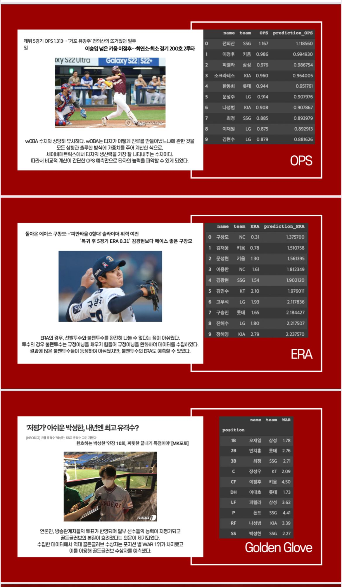

# 🧢 KBO 대시보드

```mdx-code-block
import ReactPlayer from "react-player";

<ReactPlayer
  url="https://www.youtube.com/watch?v=nmVLH_Juqcs"
/>
```

## 🧢 프로젝트 진행 과정




- Modeling
  - 18~22년의 5개년 데이터를 추출함.
  - 이상치가 많고, 적은 양의 데이터를 보완하기 위해 XGBoost, ridge, KNN regressor를 Hard Voting하여 사용


- 서버 아키텍처
  - 총 2개의 도커 서버를 사용하여 한 서버에서는 웹을 구성, 다른 서버에서는 정해진 시간에 일정한 작업을 수행할 수 있도록 Cron Server운영
  - 웹 서버에서는 React, Spring, Flask, Nginx 컨테이너를 띄워서 상호작용이 가능하도록 함.
  - 크론 서버에서는 24시간, 혹은 1분마다 모델링, 크롤링 등 정해진 크론 작업을 수행
  - Github, Travis CI, Docker Hub, AWS Elastic Beanstalk 으로 이어지는 과정을 통해 자동 배포되는 CI/CD 환경을 구축함.
- 구단 분석 : 국내 야구 갤러리를 크롤링하여 NLP를 이용해 전처리한 후, 워드클라우드 및 언급량 그래프를 통해 구단을 분석함

## 🧢 프로젝트 결과


- 실시간으로 데이터 업데이트를 진행하여 1분에 한 번 씩 결과 반영


- 하루에 한 번 씩 크롤링을 진행하여 홈페이지에 반영
- 하루에 한 번씩 업데이트 데이터를 이용하여 백엔드 서버에서 예측 모델을 돌려 예측 순위를 보여줌


- 각 팀별 페이지를 만들어 팀 별 정보(우승횟수, 주전 등), NLP한 결과 (워드클라우드) 를 보여줌


- 매일 크롤링을 진행하여 OPS/ERA 순위별로 선수들을 나열함


- 하루에 한 번 크롤링한 데이터를 모델에 넣어 예측한 결과를 보여줌

### Github

[YBO-2022](https://github.com/YBO-2022)

### Homepage

[YBO](http://ybophase1-env.eba-xrkwqpmp.ap-northeast-2.elasticbeanstalk.com/)
