# 🎧 오늘의 노래

```mdx-code-block
import ReactPlayer from "react-player";

<ReactPlayer
  url="https://www.youtube.com/watch?v=eNJJawrNq6E"
  width="100%"
  style={{
    aspectRatio: "4/3",
    maxWidth: "640px",
  }}
/>
```

## 🎧 프로젝트 설명

### 스포티파이 데이터

스포티파이 내 트랙에 대한 오디오 특성에 대한 분석 결과를 알려준다.

* Audio_features 예시

  ```tsx
  // 이 노래가 얼마나 춤추는데 적합한지에 대한 정보
  // 템포, 리듬 안정성, 비트 강도... 등을 고려한 값.
  // 0 ~ 1
  danceabliity: number;
  
  // 트랙의 intensity와 activity를 평가.
  // 높을수록 빠르고, 소리가 크다.
  // 데스메탈 -> 높은 에너지
  // 0 ~ 1
  energy: number;
  
  // 트랙의 키 (ex. C#)
  // -1 ~ 11로 평가하고, 0 = C, 1 = C# ...
  key: number;
  
  // 얼마나 시끄러운지를 dB 단위로 나타냄.
  // 일반적으로 -60 ~ 0. ???
  loudness: number;
  
  // 노래의 모드 (장조 / 단조)
  // 0 : minor, 1 : major
  mode: number;
  
  // 얼마나 말이 많은지
  // 0 ~ 1 (토크쇼)
  // 0.33 이하면 음악 + 가사없는 음악
  // 0.33 ~ 0.66 : 랩 같은 음악 ( 노래 + speech가 있는거)
  // 0.66 이상 : 거의 말만 있는 트랙들.
  speechiness: number;
  
  // 트랙이 얼마나 어쿠스틱한지.
  // 0 ~ 1로 평가
  acousticness: number;
  
  // 트랙에 보컬이 없는 정도를 예측한 값.
  // 0 ~ 1.
  // 1에 가까울수록 보컬이 없을 가능성이 높고, 0.5 이상이면 inst일 가능성이 높다
  instrumentalness: number;
  
  // 관객이 있는지에 대한 예측값.
  // 0.8 이상이면 live일 가능성이 높다
  liveness: number;
  
  // 노래의 긍정적인 척도를 나타낸다.
  // 0 ~ 1.
  // 1에 가까울수록 긍정적 (행복, 즐거움, ...)
  // 0에 가까울수록 부정적 (슬픔, 우울함, 화남, ...)
  valence: number;
  
  // BPM으로 트랙의 평균적인 템포를 나타냄.
  tempo: number;
  
  // 스포티파이에서 쓰는 노래 ID
  id: string;
  
  // 노래의 지속시간을 milisecond단위로 나타냄.
  duration_ms: number;
  
  // 몇 박인지
  // 3 -> 4분의 3박자임.
  // 3 ~ 7의 값을 가진다.
  time_signature: number;
  ```

### 추천 시스템

* Content-Based 추천 시스템

  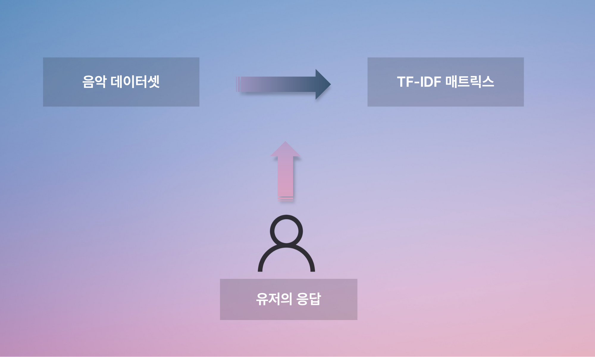

유저에 대한 데이터가 별로 없는 서비스 초기에 이용할 추천 시스템

유저에게 추천할 음악 목록을 모아놓은 데이터셋을 기반으로 TF/IDF를 계산하여 이를 tf-idf 매트릭스에 결과로 저장해둔다.

이후 유저의 취향에 대한 응답이 들어오면 이를 vectorize하여 기존 matrix와 비교, 가장 토탈 스코어가 높은 노래를 추천해준다.

* K-means Clustering 기반 추천 시스템

  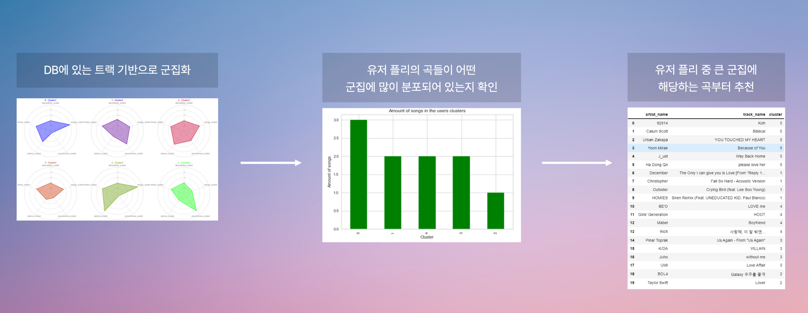

유저의 플레이리스트 데이터가 있을 때 사용할 추천 시스템. (좋아요, 기존…)

유저에게 추천할 음악 목록을 모아놓은 데이터셋을 k-means clustering을 통해서 5개의 군집으로 분류해둔다.

이후 유저의 플레이리스트에 대해서 군집 분석을 하여 어떤 군집에 유저의 플리가 많이 분포하는지 순위를 매긴다.

신곡이 들어왔을 때 유저 플리 내 군집 순서에 따라서 추천을 해줌.

* Song2Vec 기반 추천 시스템

  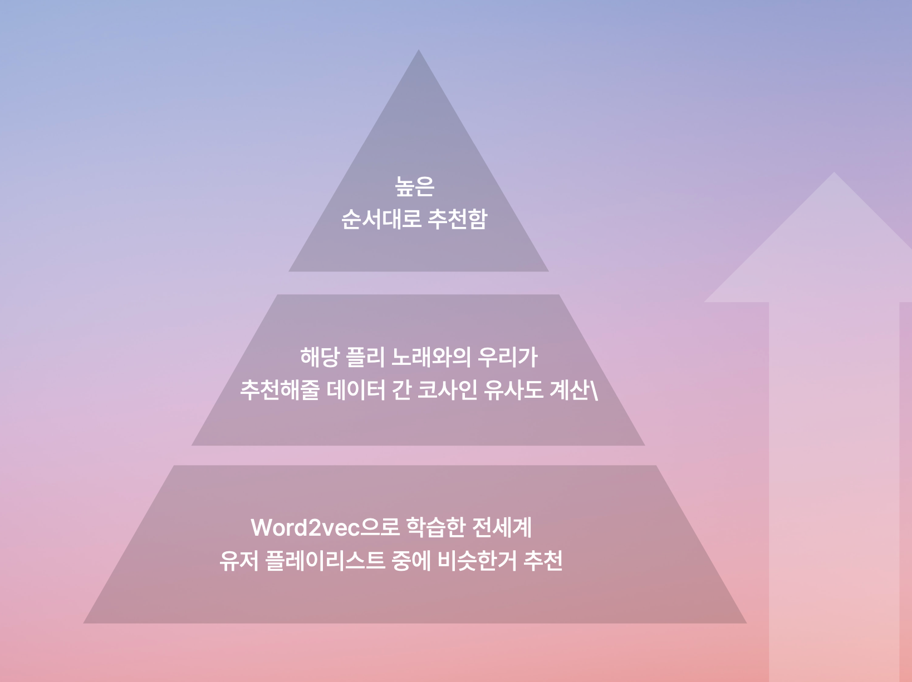

“코딩할때 듣기 좋은 음악 추천해줘" 와 같이 특정 상황이 주어졌을 때 사용하는 추천 시스템.

Kaggle 1 million playlist dataset을 Word2Vec으로 미리 학습시켜놓음.

유저에게서 상황이 주어지면, 학습시켜준 플레이리스트 목록에서 상황과 가장 비슷한 플레이리스트들을 고른다.

다음으로, 해당 플레이리스트들 내에 속한 트랙들과 우리가 추천해줄 데이터셋 내 트랙들 간의 코사인 유사도를 계산한다.

최종적으로, 이 둘 간 유사도가 높은 순서대로 추천.

## 🎧 프로젝트 아키텍쳐

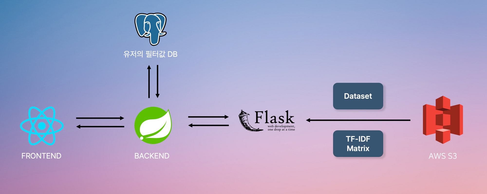

Next.js 기반 프론트엔드와 Spring boot 기반 백엔드를 사용하였다.

API 서버에서는 소셜 로그인 및 유저가 선택한 취향 필터를 DB에 저장하고, 유저로부터 곡 추천 요청이 들어왔을 때 Flask기반 모델 서버에 추천 요청을 보낸다.

Flask 모델 서버는 S3에 저장된 Dataset과 Tf-Idf 매트릭스를 이용하여 곡을 추천한다.

DB는 AWS RDB에 Postgresql을 이용하였다.

나머지 서버들은 컨테이너화 하여 AWS ECS를 이용해서 배포하였다.

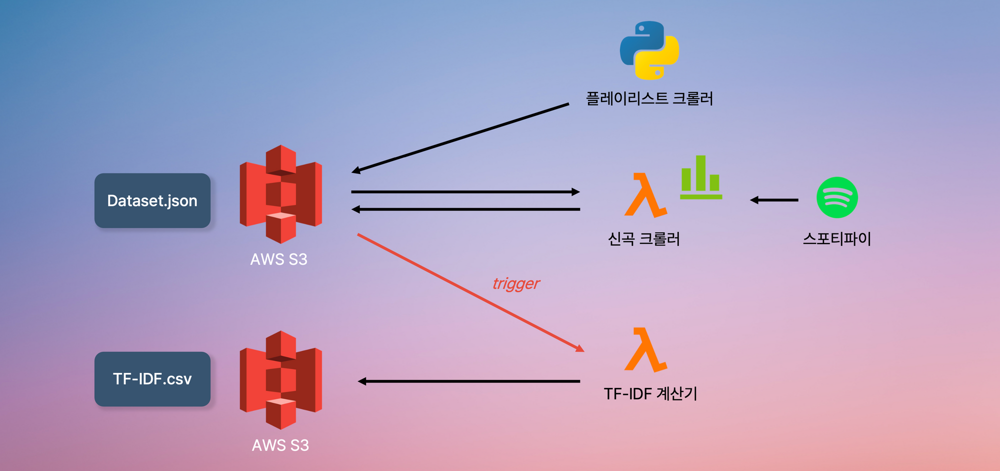

데이터셋 크롤러는 파이썬 기반 플레이리스트 크롤러, Node.js 기반 신곡 크롤러를 이용하였다.

기본적으로 사용할 데이터는 플레이리스트 크롤러를 이용해 수집하여 지정된 S3 버킷에 저장하였다.

신곡 크롤러는 AWS 람다에 업로드 후, Cloudwatch를 이용해 매일 지정된 시간에 스포티파이로부터 신곡을 크롤링하도록 설정하였다. 이후 해당 결과를 S3에 업데이트한다.

TF-IDF 계산 함수 또한 AWS 람다에 업로드 후, Dataset이 저장되어 있는 S3 버킷에 새로운 객체가 생성되는 경우 자동으로 실행되도록 트리거 설정을 하였다. 이 또한 계산 결과를 S3에 업로드한다.

## 🎧 프로젝트 결과

* 로그인 페이지

  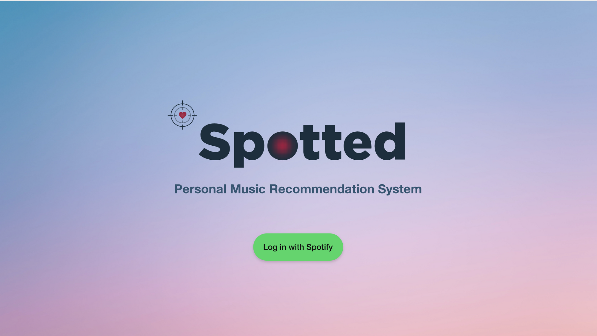

로그인은 스포티파이 소셜 로그인을 이용하였다.

* 로딩 화면

  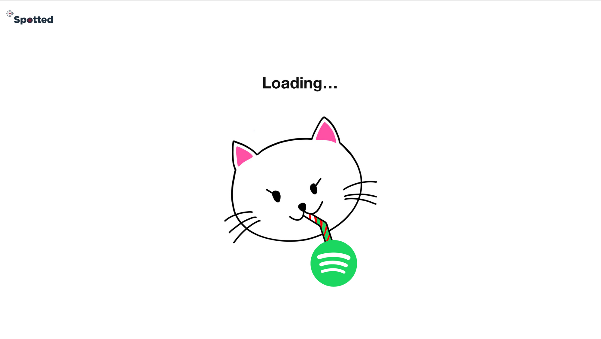

로그인 후 리디렉션 혹은 필터 조회 시 사용하는 로딩 화면

* 유저 별 필터(취향) 선택 화면

  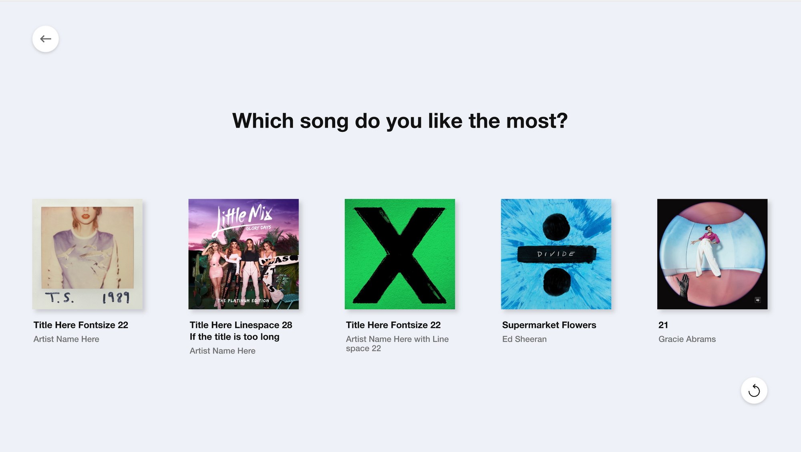
  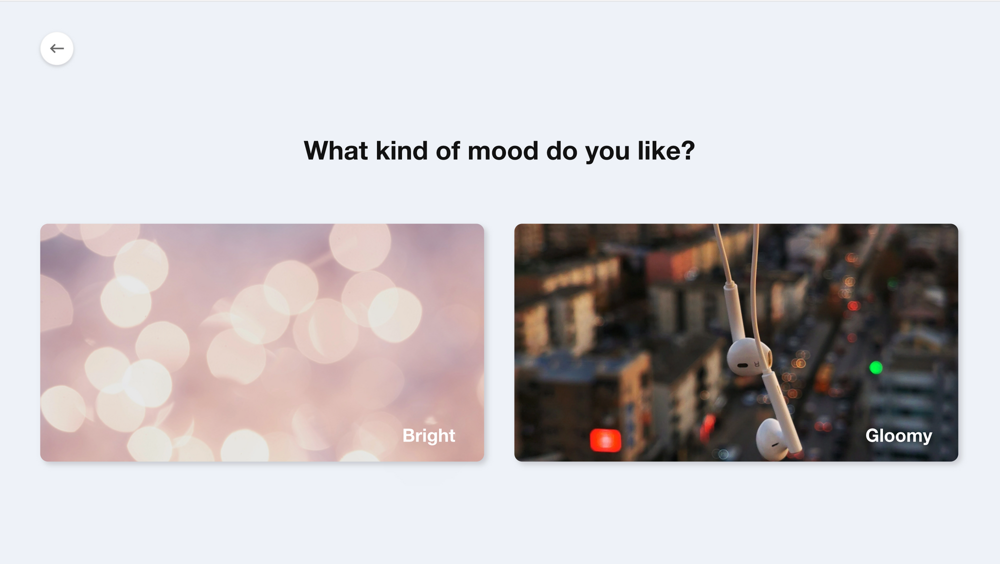
  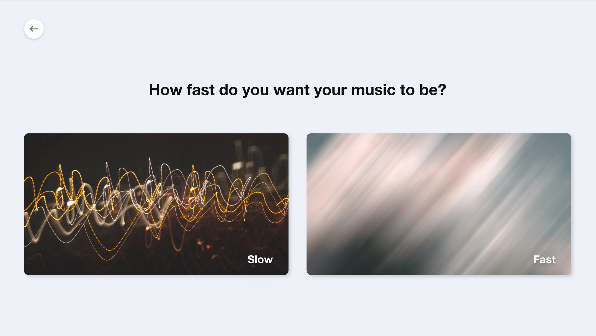
  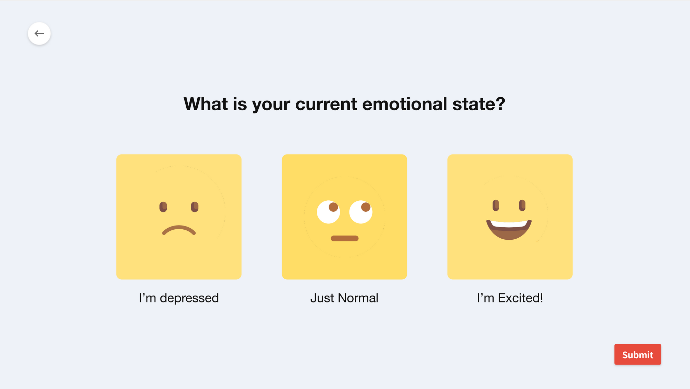

유저별로 좋아하는 노래, 속도, 무드, 현재 감정상태를 수집하여 이를 기반으로 추천을 진행하였다.

* 추천된 노래 조회 화면

  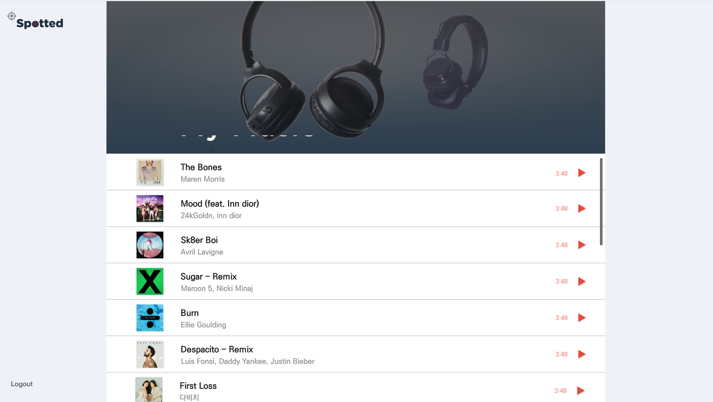
  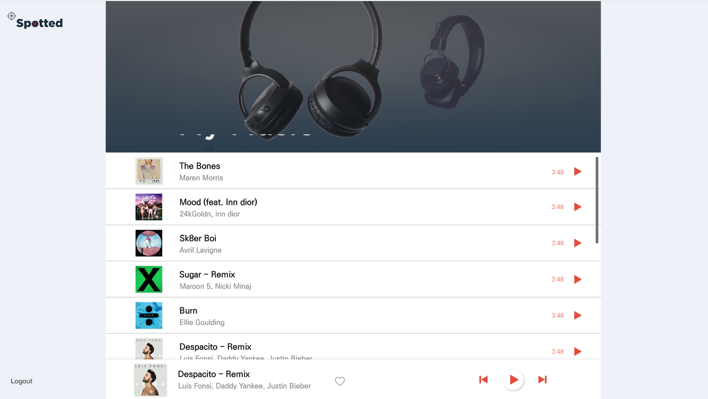

스포티파이 Web Playback SDK를 이용하여 실제로 추천받은 노래를 재생해 볼 수 있도록 구성하였다.

### Github Repository

[GitHub - ANTARES-KOR/Spotify-Music-Recommendation: 스포티파이 API를 이용한 신곡 추천 서비스 (for 와이빅타 2022-1 컨퍼런스)](https://github.com/ANTARES-KOR/Spotify-Music-Recommendation)