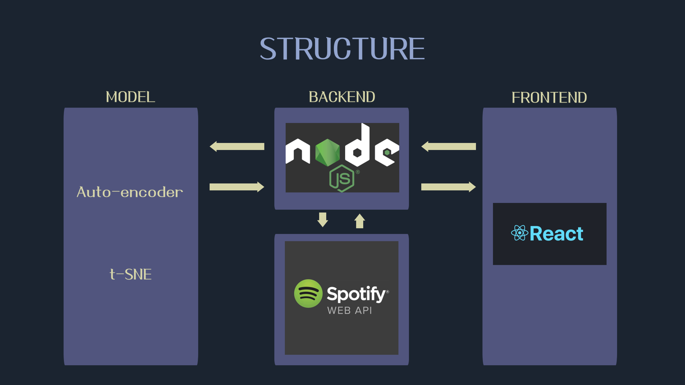
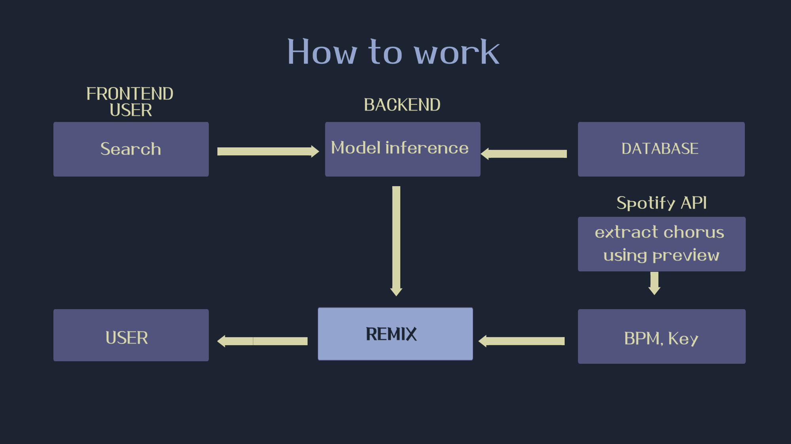
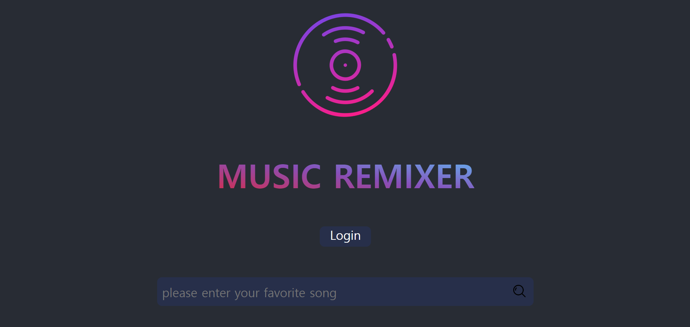
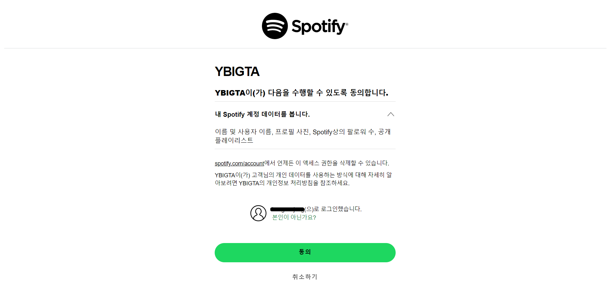
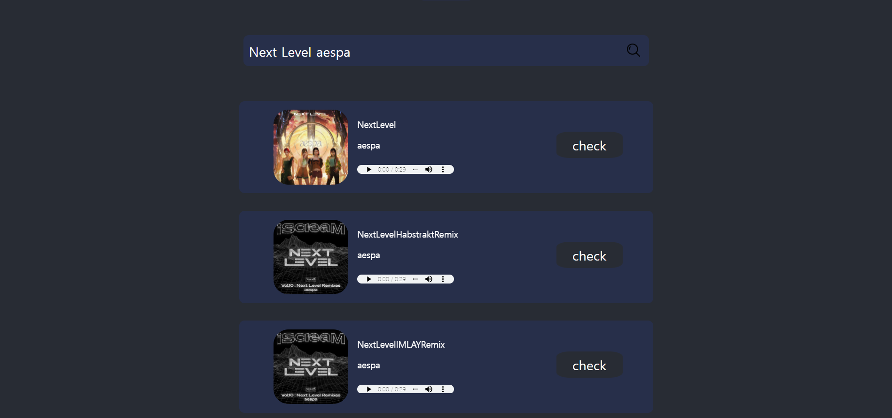
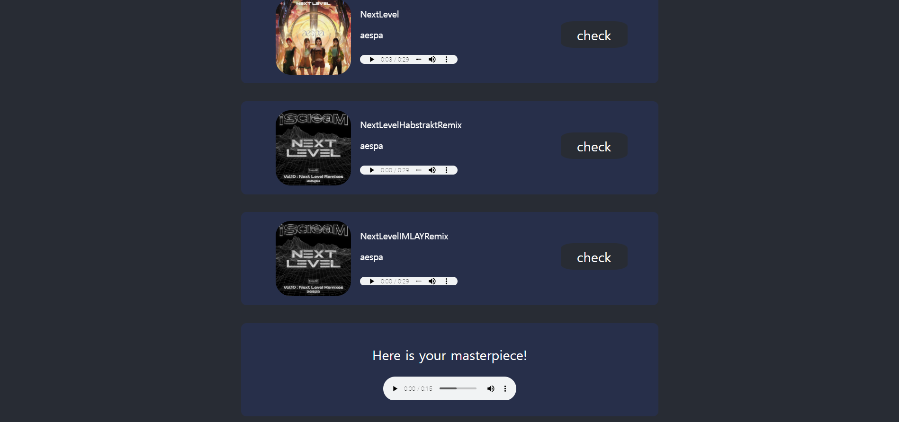

# 🎶 이 노래 지겨워!

```mdx-code-block
import ReactPlayer from "react-player";

<ReactPlayer
  url="https://www.youtube.com/watch?v=B_WxaVSvbAI"
  width="100%"
  style={{
    aspectRatio: "4/3",
    maxWidth: "640px",
  }}
/>
```

## 🎶 프로젝트 진행 과정




Frontend, Backend, Model은 화면과 같은 방법으로 구현. web page와 spotify web api를 활용하고 auto-encoder를 활용한 model에서 remix할 곡을 추천받아 remixing. Node.js로 구현한 backend가 양방향 통신으로 전체적인 sequence를 진행.

## 🎶 프로젝트 결과

webpage에서 사용자가 원하는 곡을 검색하면, 검색 결과로 세 곡이 표시되며 미리듣기를 통해 원하는 곡이 맞는지 확인할 수 있음. 원하는 곡이 맞다면 check버튼을 누르면 곧바로 해당 곡과 가장 유사도가 높은 곡을 추천하여 리믹스하여 유저에게 표시됨.




