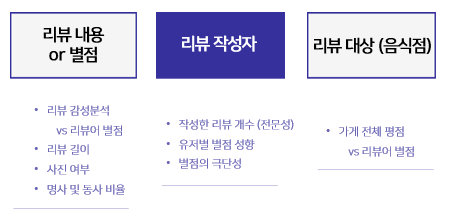
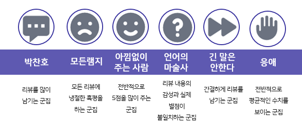
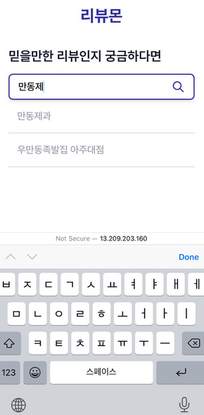
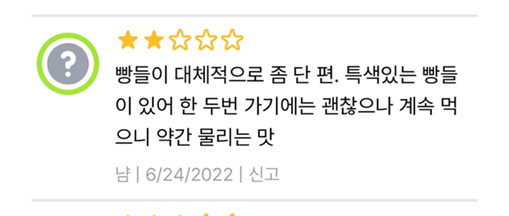
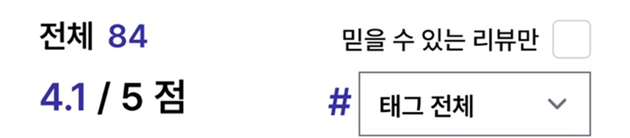
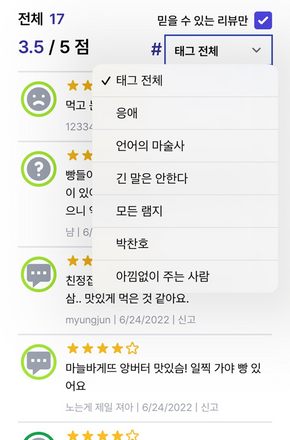
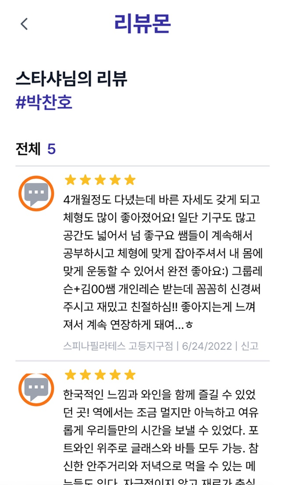
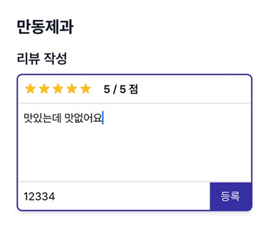
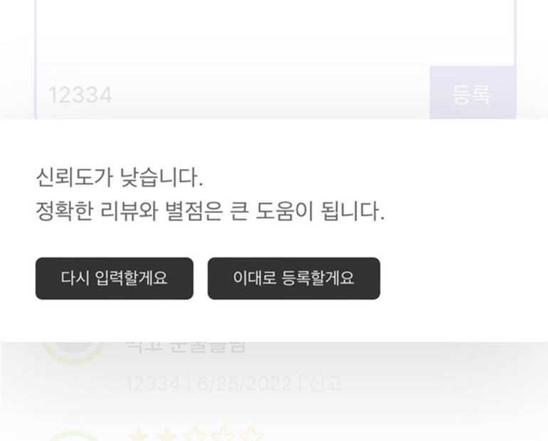

# 💬 이 리뷰 믿을 수 있어?

```mdx-code-block
import ReactPlayer from "react-player";

<ReactPlayer
  url="https://www.youtube.com/watch?v=HeA739n23Ss"
/>
```

## 💬 프로젝트 진행 과정

### 1. 데이터 전처리



1. 카카오맵 리뷰 데이터 크롤링
2. KoBERT 활용 감성분석 모델링
3. 선행연구 분석을 통한 신뢰도에 영향을 주는 변수 판단 및 데이터 처리

### 2. 클러스터링

- K-means 클러스터링 활용

SSE 값, 실루엣 지수와 칼린스키 지표 기반, 군집 수를 6개로 선정

각 군집의 특징적인 centroid 값 기반 군집별 이름 선정



### 3. 신뢰도 모델링

- Decision Tree 활용 신뢰도에 영향을 주는 변수 영향 확인
- 상관관계 분석을 통한 양, 음의 관계 파악

:::note **신뢰도 지수 수식**

✔️ 별점의 극단성  
✔️ 별점의 중립성  
✔️ 리뷰 내용의 명사 비율  
✔️ 리뷰 내용의 동사 비율  
✔️ 군집

:::

### 4. 사용 아키텍처


## 💬 프로젝트 결과: 리뷰몬

### 맛집 둘러보기


- 카카오맵 검색창 페이지로 연동되어 음식점 확인

### 가게별 리뷰 검색



- 리뷰를 확인하고 싶은 가게 명 검색

### 리뷰 신뢰도 확인



- 리뷰의 프로필: 해당 리뷰어의 군집
- 프로필 주위 색상: 해당 리뷰의 신뢰도 정도를 의미

#### 필터 1: 믿을 수 있는 리뷰만



- 신뢰도가 낮은 리뷰는 제거됨

- 가게 총 평점 또한 신뢰도 기반 조정됨

#### 필터 2: 태그



- 원하는 군집에 해당하는 리뷰어가 남긴 리뷰만 확인 가능

### 유저별 리뷰 내용 확인



- 각 리뷰어가 남긴 리뷰는 한번에 확인 가능

### 리뷰 작성




- 직접 리뷰를 작성할 수 있는 기능
- 해당 리뷰의 신뢰도가 낮다면 경고 창이 뜸
