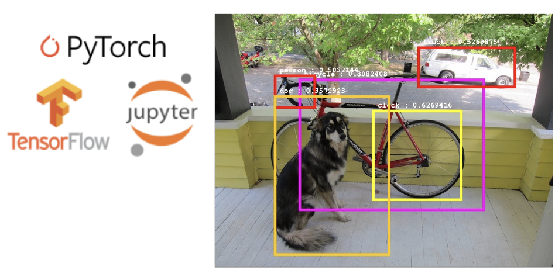

# Data Science Team

사이언스 팀은 기본적인 회귀분석과 같은 **기초적인 Machine Learning 모델부터, NLP와 컴퓨터비전에 활용되는 딥러닝 모델의 활용방법 및 작동원리**를 배우며 필요한 작업에 적합하게 이용할 수 있도록 함께 공부해 나가는 팀입니다.

세션에서는 각 학기마다 컴퓨터비전, NLP의 중요한 Milestone 모델을 중심으로 학습하며, 스터디를 통해서 세부적으로 관심을 갖고 있는 Task의 논문리딩을 진행할 수 있습니다.
